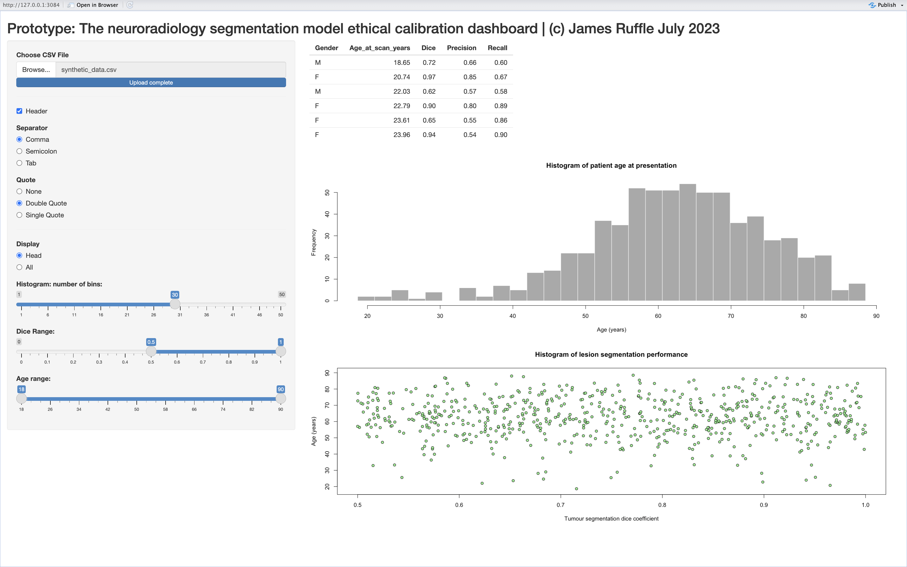

# This is a prototypic software release for an ethical-modelling-dashboard



## Table of Contents
- [Code](#code)
	- [Quickstart](#quickstart)
- [Usage queries](#usage-queries)
- [License](#license)

## Code
### Quickstart

You can start using our prototype, *with only [R](https://cran.r-project.org) and [Shiny](https://www.r-project.org/nosvn/pandoc/shiny.html) required*, in **just 3 simple steps**:

1) Download the repository, either by
	- Clicking [here](https://github.com/jamesruffle/ethical-modelling-dashboard/archive/refs/heads/main.zip).
	- **Using the terminal** ```git clone https://github.com/jamesruffle/ethical-modelling-dashboard.git```

2) In [R](https://cran.r-project.org), open and run the file ```app.R```.

3) Load in the file ```synthetic_data.csv``` using the 'Import CSV file' option in the dashboard top left corner. The csv is supplied as part of this repository (and should be downloaded as part of step 1).


## Usage queries
Via [GitHub issues](/issues).


## License
The code in this repository is licensed under a permissive [MIT License](LICENSE). All other content is licensed under CC BY 4.0. This means you may use any content in this repository as long as you credit the authors.
