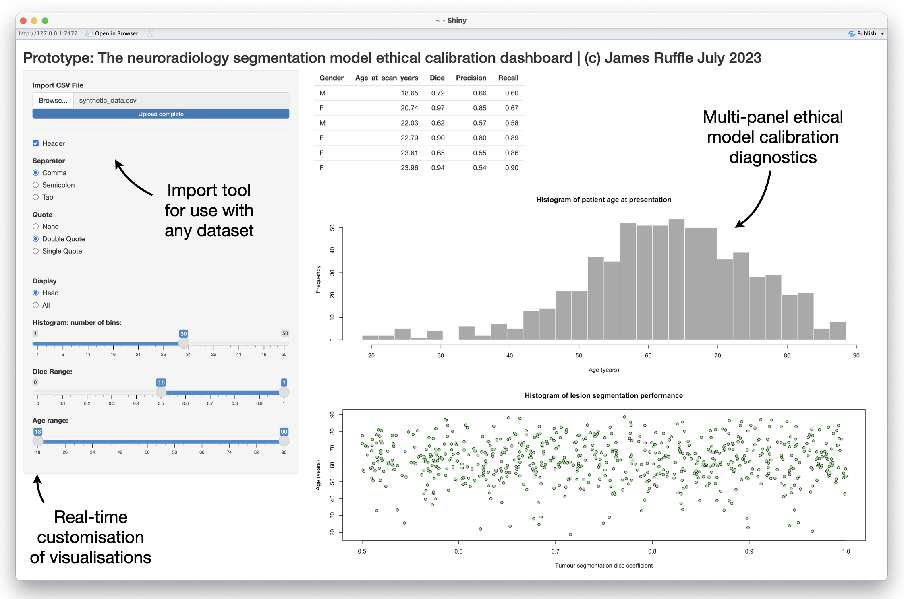

# This is a prototypic software release for an ethical-modelling-dashboard



## Table of Contents
- [What is this repository for?](#what-is-this-repository-for)
	- [The problem](#the-problem)
	- [Our solution](#our-solution)
- [Code](#code)
	- [Quickstart](#quickstart)
- [Usage queries](#usage-queries)
- [License](#license)

## What is this repository for?

### The problem

### Our solution

## Code
### Quickstart

You can start using our prototype, *with only [R](https://www.python.org/) and [shiny]() required*, in **just 3 simple steps**:

1) **Using the terminal**
```
git clone https://github.com/WellcomeIdeathon2023/MindfulAI
python -m http.server
```

2) In [R](), open and run the file
```
app.R
```

3) Load in the file ```synthetic_data.csv```, supplied in this repository (and downloaded as part of step 1).


## Usage queries
Via [GitHub issues](/issues).


## License
The code in this repository is licensed under a permissive [MIT License](LICENSE). All other content is licensed under CC BY 4.0. This means you may use any content in this repository as long as you credit the authors.